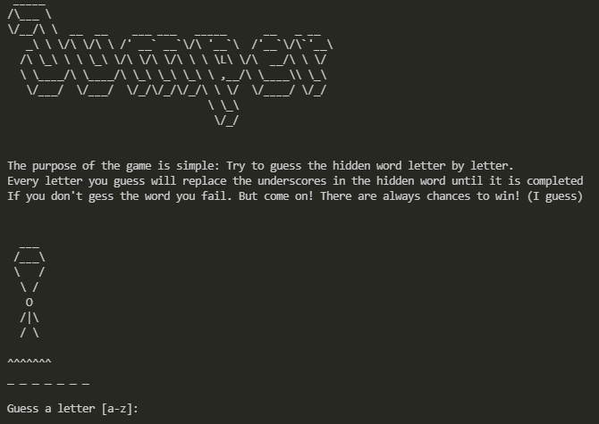

# cse210-03
CSE210, Week 5 team group assignment, Jumper Game
<p align="center">
  
</p>

# Jumper
Welcome to the Jumper Game, It is very simple to play and straight forward, in this game the player trys to guess letters of a secret word, one at a time and if the letter is not in the puzzle, the parachute loses a line. So the keeps on guessing until the puzzle get solved in case the parachute loses every line the game is lost.  

## Getting Started
---
Make sure you have Python 3.10.1 or newer installed and running on your machine. Run the program from an IDE like Visual Studio Code. Start your IDE and open the project folder. Select the __main__.py module inside the game folder and click the "run" (green triangle) button.

## Project Structure
---
The project files and folders are organized as follows:
```
root                   	    (project root folder)
  +--__main__.py		    (program entry point)
  +--README.md			    (general info)
  +--game/           	    (modules)
    +--instructions.py      (big menu and instructions)
    +--Jumper.py		    (source code for game)
    +--puzzle.py            (game class with methods)
    +--terminal_service.py  (game class with methods)
    +--director.py		    (Game logic)

```

## Required Technologies
---
* Python 3.10.1

## Authors
---
* [Cameron Barrett](https://github.com/Cams1stGitHub) 
* [Robert Odell](https://github.com/rodell1983)
* [Wilson Romero](https://github.com/wilsonBYU)
* [Nourcel Kaniki](https://github.com/Nourcel)

